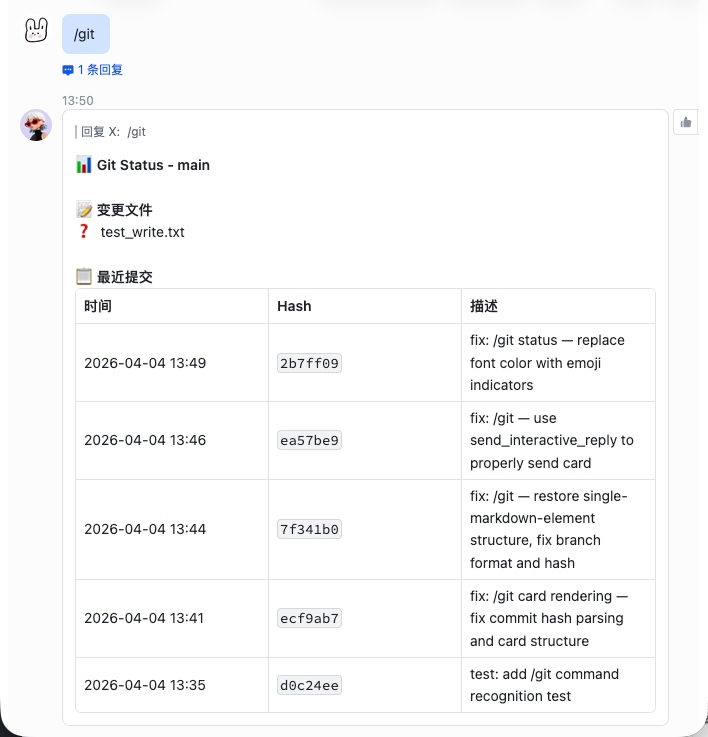
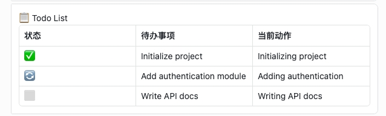

# cc-feishu-bridge

> **⚠️ 此项目已停止维护** — cc-feishu-bridge 已迁移到新项目 **[SuperCC](https://github.com/Hu1J/supercc)**。所有新功能将在 SuperCC 中继续开发。当 PyPI 上存在 SuperCC 时，执行 `/update` 会自动完成数据迁移并切换到 SuperCC。

Claude Code 飞书桥接插件 — 在飞书中与本地 Claude Code 对话，同时具备**记忆自优化**和**技能自进化**能力。

## 核心能力

cc-feishu-bridge 不只是一个飞书桥接器，它是一个**有记忆、会反思、能进化**的 AI 工作搭档：

| 能力 | 说明 |
|------|------|
| **记忆自优化** | 每日凌晨自动精炼记忆库 — 合并冗余、精简啰嗦、删除过时内容 |
| **技能自进化** | 每次对话后自动检查 skills 目录变化，有更新自动 git commit |
| **三次独立对话** | 主对话 / 记忆优化 / 技能审核互不干扰，各有独立 Claude session |
| **Cron 定时任务** | 支持标准 cron 表达式，自动推送执行结果到飞书 |
| **记忆系统** | SQLite + FTS5 中文全文搜索，每次对话注入相关记忆 |
| **实时流式推送** | Claude 生成回复时实时推送，工具调用立即 flush |
| **精美卡片渲染** | Edit/Write 彩色 diff、AskUserQuestion 问卷卡片、记忆工具卡片 |

## 命令

| 命令 | 说明 |
|------|------|
| `/new` | 创建新会话 |
| `/status` | 查看当前会话状态 |
| `/stop` | 打断 Claude 当前正在执行的查询 |
| `/git` | 显示当前项目 git status 和最近提交 |
| `/switch <目录>` | 切换到另一个项目的 bridge 实例 |
| `/restart` | 重启当前 bridge 实例 |
| `/update` | 检查 PyPI 最新版本，如有更新则自动下载并重启 |
| `/memory` | 管理本地记忆库（user/proj 子命令） |
| `/cron` | 管理定时任务（add/del/list/pause/resume/run） |
| `/help` | 查看所有可用命令 |

## 群聊支持

机器人支持飞书群聊 @CC 交互：

- **@CC 响应**：群聊中 @机器人 才能触发回复（避免刷屏）
- **上下文感知**：@CC 消息自动注入最近 20 条群聊历史
- **per-group 配置**：可按群配置 `enabled`、`require_mention`、`allow_from`

> **⚠️ 必选权限**：群聊历史注入需要在飞书开放平台给机器人添加 `im:message.group_msg` 权限。

## 记忆系统

cc-feishu-bridge 内置本地记忆系统，让 Claude Code 记住曾经踩过的坑，不再重复犯错。

### 记忆类型

| 类型 | 说明 | 作用域 | 获取方式 |
|------|------|--------|----------|
| `用户偏好` | 用户的编码原则、职责、发版规则等 | 全局共享 | 每次对话自动注入 prompt |
| `项目记忆` | 项目背景知识 / 踩坑记录 | 项目隔离 | 每次对话按项目注入 |

### 记忆做梦（自动精炼）

每日凌晨 3 点，Bridge 自动启动记忆精炼流程：

1. 审查所有用户偏好和项目记忆
2. 合并内容高度相似的条目
3. 精简冗长啰嗦的描述
4. 删除过时或无关的记忆

精炼完成后，早上 8 点推送总结报告到飞书。

### CLI 管理

```bash
# 用户偏好
cc-feishu-bridge memory user add <title>|<content>|<keywords>
cc-feishu-bridge memory user list
cc-feishu-bridge memory user search <关键词>
cc-feishu-bridge memory user del <id>
cc-feishu-bridge memory user update <id>|<title>|<content>|<keywords>

# 项目记忆
cc-feishu-bridge memory proj add <title>|<content>|<keywords>
cc-feishu-bridge memory proj list --project <路径>
cc-feishu-bridge memory proj search <关键词>
cc-feishu-bridge memory proj del <id>
cc-feishu-bridge memory proj update <id>|<title>|<content>|<keywords>
```

飞书端：`/memory` 查看帮助。

## 技能自进化

Bridge 自动监控 `~/.cc-feishu-bridge/skills/` 目录（你的私人 skills）：

- 启动时检测 skills 目录是否已 git init，没有则自动初始化
- 每次对话完成后，检查 skills 目录是否有未提交的变更
- 有变更时自动 git add + git commit（每 10 次工具调用触发一次审核）
- 审核触发：独立 Claude session 在后台运行，评估 skill 质量后给出改进建议
- 改进建议自动 commit，完成技能进化闭环

skills 目录由 Bridge **自己管理**，通过 cron 定时任务和对话触发双重机制驱动。

## 定时任务（Cron）

通过 `/cron` 命令或 MCP 工具管理定时任务：

```
/cron add "every 1h" <prompt>   — 创建循环任务
/cron add "0 9 * * *" <prompt>  — cron 表达式
/cron list                       — 列出所有任务
/cron del <id>                   — 删除任务
/cron pause <id>                 — 暂停
/cron resume <id>                — 恢复
/cron run <id>                   — 立即触发一次
```

执行结果自动推送到飞书，支持 verbose 模式（流式中间过程）。

## 内置编码原则

cc-feishu-bridge 内置了来自 [andrej-karpathy-skills](https://github.com/forrestchang/andrej-karpathy-skills) 的编码原则：

- **编码前思考** — 不要假设，困惑时停下来提问
- **简洁优先** — 用最少的代码解决问题
- **精准修改** — 只碰必须碰的
- **目标驱动执行** — 定义可验证的成功标准

启动时自动检查当前项目是否已有 `CLAUDE.md`，如无则创建，如已则注入编码原则。

## 核心功能

- **工作目录即 Claude 的工作目录** — 在哪个目录下启动，就在哪个目录下工作
- **消息队列** — 所有消息串行处理，不会出现并发冲突
- **引用回复** — Claude 的每条回复作为引用回复发出，对话结构清晰
- **引用消息感知** — 引用某条消息发送时，Claude 能感知原文
- **实时流式推送** — Claude 生成回复时实时推送，工具调用立即 flush
- **工具调用精美卡片** — Edit/Write 彩色 diff（行号 + 增删着色）；Bash 以代码段展示；Read 显示文件路径；TodoWrite 渲染为待办表格；Git Status 展示状态和最近提交
- **三次独立 Claude 实例** — 主对话 / 记忆优化 / 技能审核完全隔离

## 截图展示

### Edit / Write 彩色 Diff


### Bash 工具


### Git Status



### TodoWrite 待办列表



### 记忆工具卡片

记忆 add/update/list/search/delete 各有专属卡片格式。

### 日常对话


## 快速开始

### 方式一：pip 安装（推荐）

```bash
pip install -U cc-feishu-bridge
cc-feishu-bridge
```

### 方式二：源码安装

```bash
git clone https://github.com/Hu1J/cc-feishu-bridge.git
cd cc-feishu-bridge
pip install -e .
cc-feishu-bridge
```

## 安装配置

首次运行 `cc-feishu-bridge` 时会自动进入安装流程，按提示操作即可（飞书扫码授权 → 创建机器人）。

配置文件位于 `.cc-feishu-bridge/config.yaml`（相对于启动目录）。

### 手动配置

```yaml
feishu:
  app_id: cli_xxx          # 飞书应用 App ID
  app_secret: xxx          # 飞书应用 App Secret
  bot_name: Claude

auth:
  allowed_users:            # 允许使用机器人的用户 open_id 列表
    - ou_xxx

claude:
  cli_path: claude          # claude CLI 路径
  max_turns: 50             # 最大对话轮数
  approved_directory: /path/to/workdir  # Claude 工作目录

storage:
  db_path: .cc-feishu-bridge/sessions.db
```

## 多开实例

在不同目录下启动 `cc-feishu-bridge`，即可同时运行多个机器人实例，每个实例有独立的工作目录和配置文件：

```bash
cd /path/to-project-A && cc-feishu-bridge  # 机器人 A 在 /path/to/project-A 下工作
cd /path/to-project-B && cc-feishu-bridge  # 机器人 B 在 /path/to/project-B 下工作
```

## 项目切换

在飞书消息中发送 `/switch <目标目录>` 即可在不停机的情况下将消息流切换到另一个项目。

## 安全说明

`cc-feishu-bridge` 以 **bypassPermissions 模式**运行，Claude Code 可执行任意终端命令、读写本地文件，无需每次授权确认。请仅在可信任的网络环境下使用。

## 获取帮助

如有问题请提交 [Issue](https://github.com/Hu1J/cc-feishu-bridge/issues)。

## 更新日志

详见 [CHANGELOG.md](./CHANGELOG.md)。
